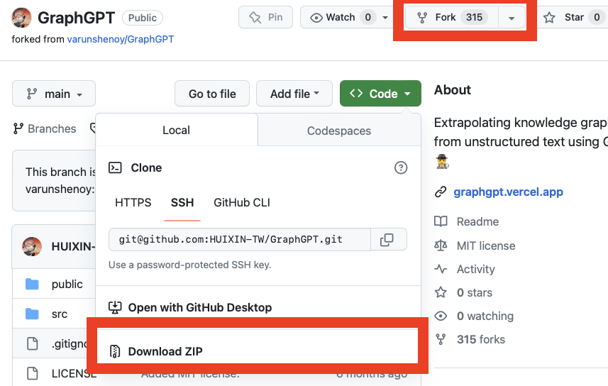
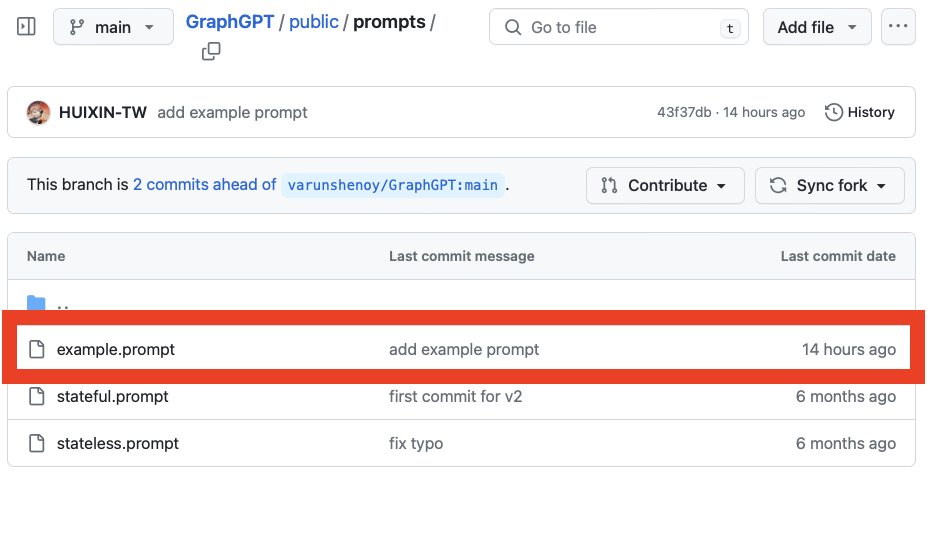
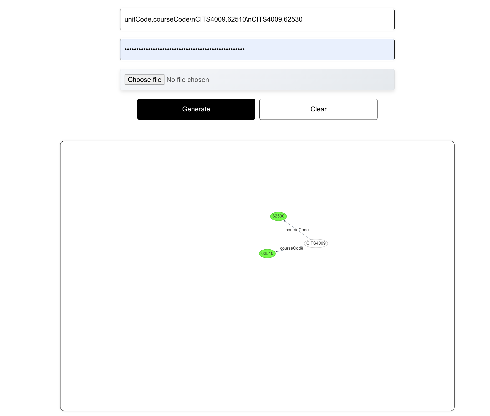
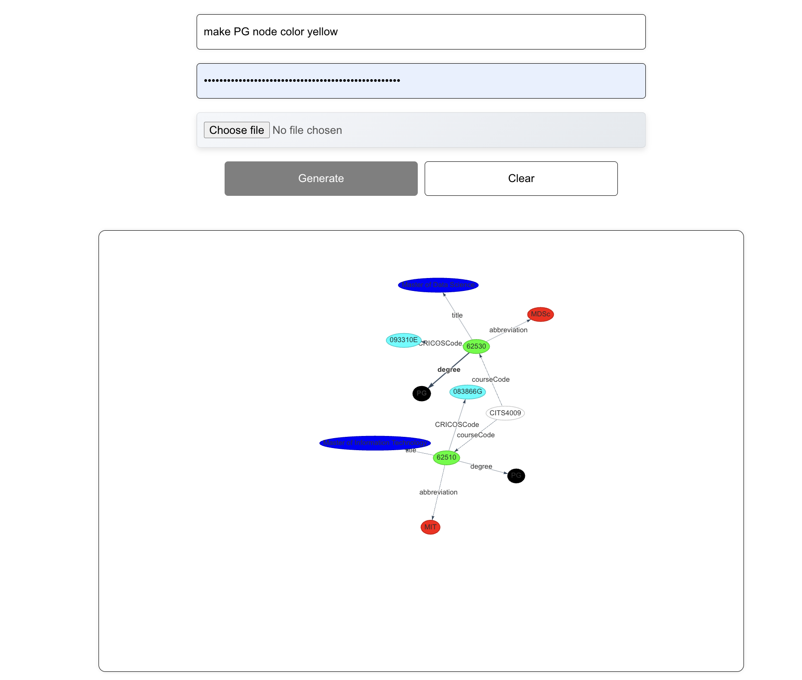
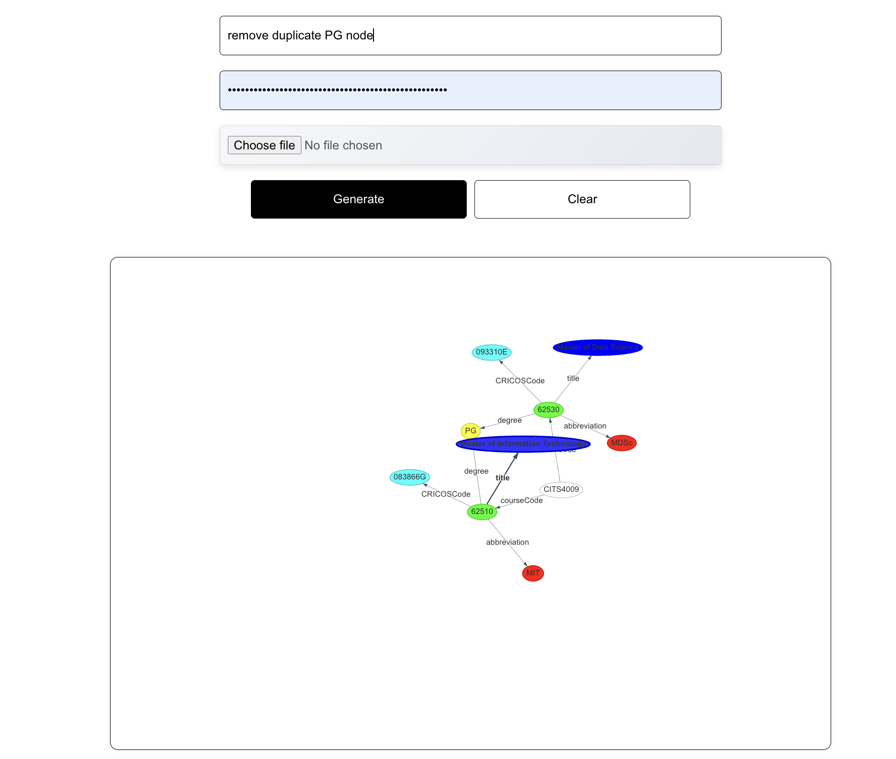

# GraphGPT
## Natural Language → Knowledge Graph


_If you want to use knowledge graphs in your project, check out [GPT Index](https://github.com/jerryjliu/gpt_index)._

GraphGPT converts unstructured natural language into a knowledge graph. Pass in the synopsis of your favorite movie, a passage from a confusing Wikipedia page, or transcript from a video to generate a graph visualization of entities and their relationships.

Successive queries can update the existing state of the graph or create an entirely new structure. For example, updating the current state could involve injecting new information through nodes and edges or changing the color of certain nodes.

The current few-shot prompt guides GPT-3 in accurately understanding the JSON formatting GraphGPT requires for proper rendering. You can see the entire prompt in `public/prompts/xxx.prompt`. A major issue at the moment is latency. Due to the nature of OpenAI API calls, it takes up to 20 seconds to receive a response.

## Expected Functions

- [ ] Take csv files as input
- [ ] Generate a graph from the csv files
- [ ] Allow users to query the graph
- [ ] Allow users to update the graph
- [ ] Allow users to change the color of nodes
- [ ] Allow users to change the color of edges
- [ ] Allow users to export the graph as a triple class

## Possoible Issues

- [ ] When the input is empty and users click "Generate", the default or random graph will be displayed
- [ ] The Graph zone is not scrollable
- [ ] The graph is not responsive to the size of the window.
- [x] Stateless and Stateful components require different formatting due to stop symbol.

## How to install GraphGPT

### Download or Fork



### Run web app

1. Run `npm install` to download required dependencies (currently just [react-graph-vis](https://github.com/crubier/react-graph-vis)).
2. Make sure you have an [OpenAI API key](https://platform.openai.com/account/api-keys). You will enter this into the web app when running queries.
3. Run `npm run start`. GraphGPT should open up in a new browser tab.

### Find a example file

Prompts are located in the `public/prompts` folder.



### Test the prompt example

1. text input


2. change the color of the node


3. remove duplicate nodes


Modify the prompt to make GraphGTP works better!

## Data

Obtain all csv files from [AccreditationExplorer](https://github.com/nlp-tlp/AccreditationExplorer)

| File Name                 | Content                                  | Structure                                                                                                                                                                                                                                                                                    |
| :------------------------ | :--------------------------------------- | :------------------------------------------------------------------------------------------------------------------------------------------------------------------------------------------------------------------------------------------------------------------------------------------- |
| activity.csv              | Unit Activities                          | <ul><li>unitCode: string, to uniquely identify a unit</li><li>unit: string, name of unit</li><li>activity: string, to match different activity according to unit</li></ul>                                                                                                                   |
| advisable_prior_study.csv | Unit Prior Studies Prerequisites         | <ul><li>unitCode: string, uniquely identify a unit that one wants to study</li><li>apUnitCode: string, uniquely identify a unit advised to have studied before</li></ul>                                                                                                                     |
| AQF.csv                   | Unit Outcomes and AQF ID                 | <ul><li>unitCode: string, uniquely identify a unit</li><li>aqfId: string, identify corresponding AQF Id </li><li>outcomeId: integer, corresponding to unit outcome Id</li></li></li></ul>                                                                                                    |
| cbok_end.csv              | End Level CBoK (E.g: abstraction)        | <ul><li>End: End levels CBoK</li><li>Sub: Sub levels CBoK, map to End levels</li></ul>                                                                                                                                                                                                       |
| cbok_sub.csv              | Sub Level CBoK (E.g: problem solving)    | <ul><li>Sub: Sub levels CBoK</li><li>Top: Top levels CBoK, map to Sub levels</li></ul>                                                                                                                                                                                                       |
| cbok_top.csv              | Top Level CBoK (E.g: General, Essential) | Two lines string containing CBoK top level knowledge areas                                                                                                                                                                                                                                   |
| course.csv                | Program Course Information               | <ul><li>courseCode: string, uniquely identify course</li><li>title: string</li><li>abbreviation: string, abbreviation of the course title</li><li>CRICOSCode: string</li><li>degree: string, it is either PG or UG</li></ul>                                                                 |
| MIT_AQF_Outcome_cat.csv   | AQF categories for MIT                   | <ul><li>Program: string, abbreviated program name (MIT)</li><li>ID: integer, used to identify AQF category</li><li>Category: string, AQF category name </li><li>Description: string, full description </li></ul>                                                                             |
| MIT_AQF_Outcomes .csv     | AQF outcomes for MIT                     | <ul><li>aqfId: string, used to identify aqf outcome </li><li>Description: string, full outcome description</li><li>Area\_ key : integer, used to link to aqf category </li></ul>                                                                                                             |
| incompatibilities.csv     | Units Incompatibilites                   | <ul><li>unitCode: string, uniquely identify a unit</li><li>iUnitCode: string, uniquely identify a unit that is incompatible with unitCode.</li></ul>                                                                                                                                         |
| outcome.csv               | Unit Outcomes                            | <ul><li>unitCode: string, uniquely identify a unit</li><li>outcome: string, to match different outcome according to unit</li><li>outcomeId: integer, label the outcome in the unit with a serial number</li><li>level: string</li><li>describe: string, to explain the level means</li></ul> |
| prer_course.csv           | Course Prerequisites for Units           | <ul><li>unitCode: string, uniquely identify a unit</li><li>courseCode: string, uniquely identify a course</li></ul>                                                                                                                                                                          |
| prer_program.csv          | Programming Units Prerequisites          | <ul><li>unitCode: string, uniquely identify a unit</li><li>programmingPoint: integer, points of programming-based units required by specific unit</li></ul>                                                                                                                                  |
| prer_unit.csv             | Unit to Unit Prerequisites               | <ul><li>unitCode: string, uniquely identify a unit</li><li>preUnitCode: string, uniquely identify a unit studied</li></ul>                                                                                                                                                                   |
| role.csv                  | Units Role in Program Course             | <ul><li>unitCode: string, uniquely identify a unit</li><li>courseCode: string, uniquely identify a course</li><li>role: string, Conversion, Option or Conversion</li></ul>                                                                                                                   |
| unit.csv                  | Units Information                        | <ul><li>unitCode: string, unit code</li><li>title: string</li><li>credit: integer, each unit has 6 points</li><li>programmingBased: integer, 0 or 1, 0 for non-programming-based, 1 for programming-based</li><li>availabilities: string</li></ul>                                           |
| unit_activity_cbok.csv    | Unit-Activities-CBoK Mappings            | <ul><li>unitCode: uniquely identify a unit</li><li>unit: string, name of unit</li><li>activity: string, activity title of a unit</li><li>knowledge: string, CBoK knowledge area</li><li>taxonomy: string, Bloom’s taxonomy </li></ul>                                                        |


## Demo

First prompt
```
unitCode,courseCode\nCITS4009,62510\nCITS4009,62530
```

Second prompt

```
unitCode,title,credit,programmingBased,availabilities\nCITS4009,"Computational Data Analysis",6,1,"Semester 2 2021, Crawley (Face to face); Semester 2 2021, Crawley (Online-TT) [Contact hours: n/a];"
```

Third prompt

```
courseCode,title,abbreviation,CRICOSCode,degree\n62510,Master of Information Technology,MIT,083866G,PG\n62530,Master of Data Science,MDSc,093310E,PG
```